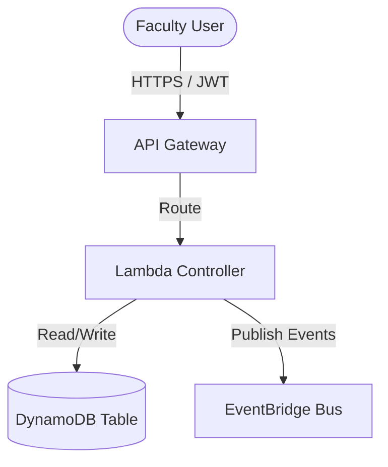

# High-Level Architecture Overview: [Feature/Module Area Name]

This document outlines the high-level design, component communication, and technical patterns for the **[Feature/Module Area Name]** modules in the PRAJNA platform.

---

## 🗺️ 1. Module Context & Scope

Provide a brief summary of the modules covered by this stack, who they serve, and how they connect to the core PRAJNA event system.

---

## ⚙️ 2. Key Architectural Decisions

List any localized architectural choices and their rationale.

| Decision ID | Choice | Alternative | Rationale |
|---|---|---|---|
| **ADR-XYZ** | [e.g., Single-table design] | [e.g., Multi-table design] | [e.g., Performance, single fetch profile] |

---

## 🗄️ 3. Shared Data Models

Explain the key entities and how they are stored (S3, DynamoDB, Aurora Serverless v2).

### DynamoDB Key Schema Mapping (if applicable)

| Entity Type | PK | SK | Attributes |
|---|---|---|---|
| **Profile** | `FACULTY#<Id>` | `METADATA` | `{ email, name, dept }` |
| **Publication** | `FACULTY#<Id>` | `PUB#<Doi>` | `{ title, journal, year, proofS3Key }` |

---

## 🔄 4. Event & Message Flows

Outline events published or subscribed to by this stack.

### Events Published:
- **`PRAJNA.FacultyData.PublicationCreated`**: Emitted when a new publication proof is uploaded.
- **`PRAJNA.FacultyData.ProfileUpdated`**: Emitted when core details change.

### Events Subscribed to:
- **`PRAJNA.Approval.Approved`**: Listens for certificate or publication approval to update status.

---

## 🔒 5. Access Control & Tenancy

Detail how multi-campus isolation and Role-Based Access Control (RBAC) are enforced:
- **Campus Isolation:** Describe partition key prefixing or row-level constraints.
- **Cognito User Roles:** Specify which roles (`Faculty`, `HoD`, `Director`, etc.) have access to which API endpoints.
